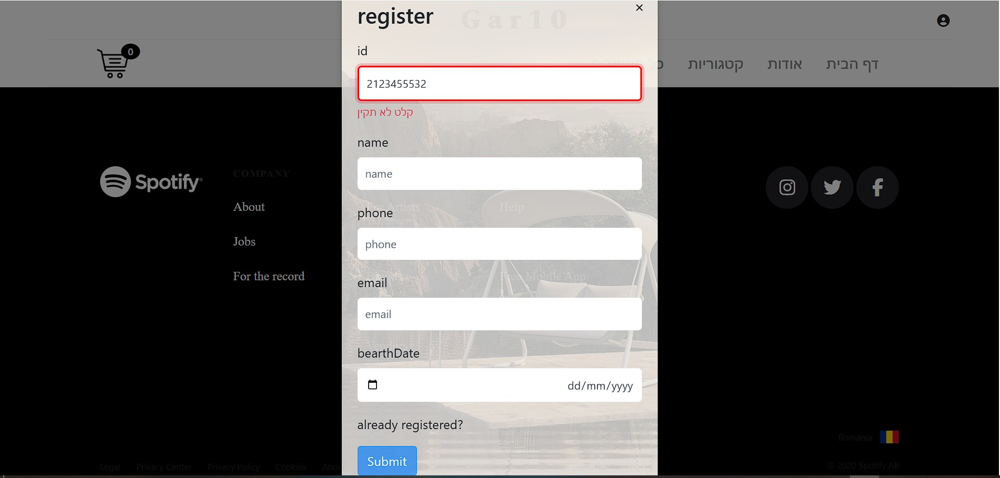
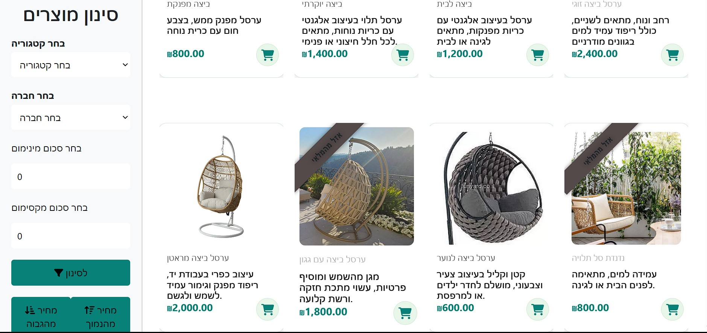
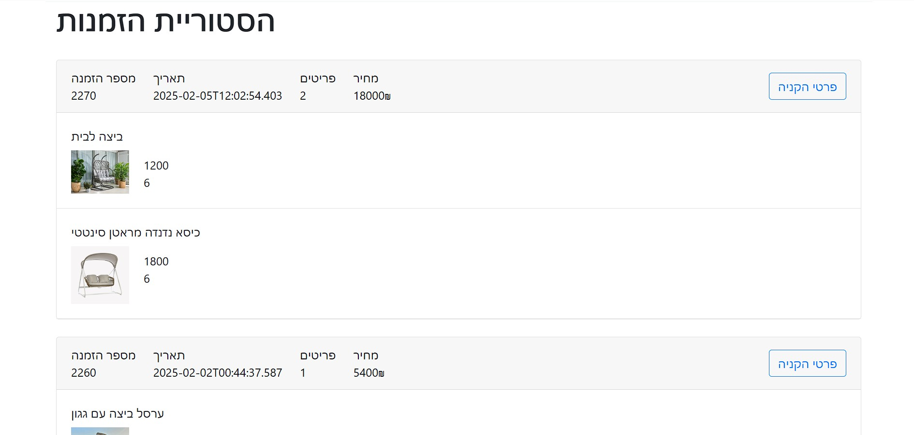
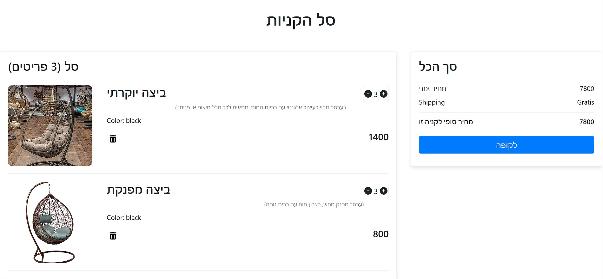
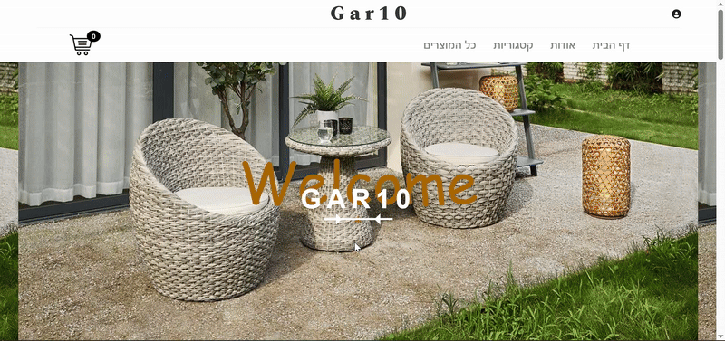

# patio_furniture
A comprehensive e-commerce website for selling patio furniture and accessories. The platform includes product display with advanced filtering options, a persistent shopping cart that remains active between sessions, purchase saving integrated with a database, handling of exceptional cases such as out-of-stock items, and various other exciting features.
## Features
• Browse available products.  
• Filter by categories, price or tags.  
• Add products to a persistent cart.  
• Register and log in securely.  
• Place and manage orders via the user dashboard.  
• View product history.  
• Pay the amount to be paid at checkout, the shipping option must be relevant.
## 🛠 Technologies
• **Frontend**: Angular 19  
• **Backend**: ASP.NET Core C# 8.0  
• **Database**: Microsoft SQL Server  
• **Communication**: REST API
## 🔧 Installation and Setup
### Backend (C# .NET)
• Open the solution in Visual Studio.  
• Configure the appsettings.json file with your SQL Server connection string.  
• Run database migrations if applicable.  
• Start the backend server.

### Frontend (Angular)
To install and run the application locally, follow these steps:  
Clone the repository:  
git clone [https://github.com/DassiErenshtein/patio_furniture.git](https://github.com/DassiErenshtein/patio_furniture.git)  
• Navigate to the frontend folder:  
cd Angular  
• Install dependencies: 
```bash
npm install
```
• Run the Angular development server:
```bash
ng serve
```
• Open a browser and navigate to:  
http://localhost:4200/
## 🖼️ Screenshots

### Login Or Register


### Products


### Orders History

### Shopping Cart


---

## 🎥 Demo Video
### Home Page


---

## Author
Developed by Hadasa Erenshtein
